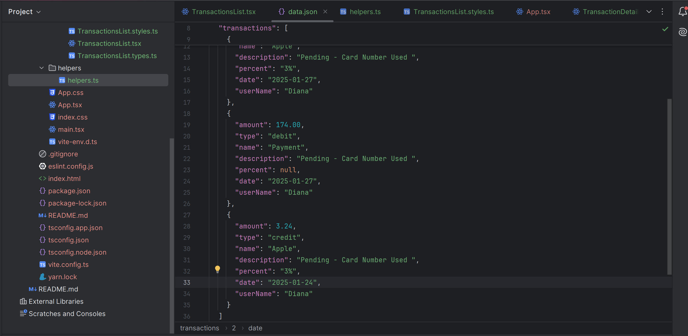
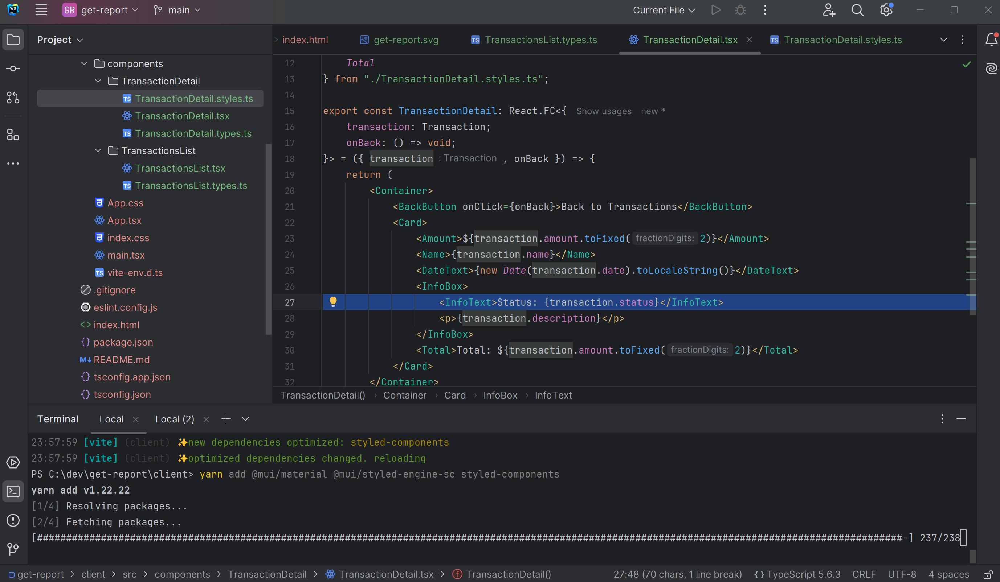

# Wallet App

This is an application for managing transactions. It includes:

- Viewing card balance
- Transaction list
- Transaction details

## Screenshots

### Main Screen


### Transaction Details


## How to Run the Project

1. Install dependencies:
   ```bash
   npm install
   npm run dev 
   ```
